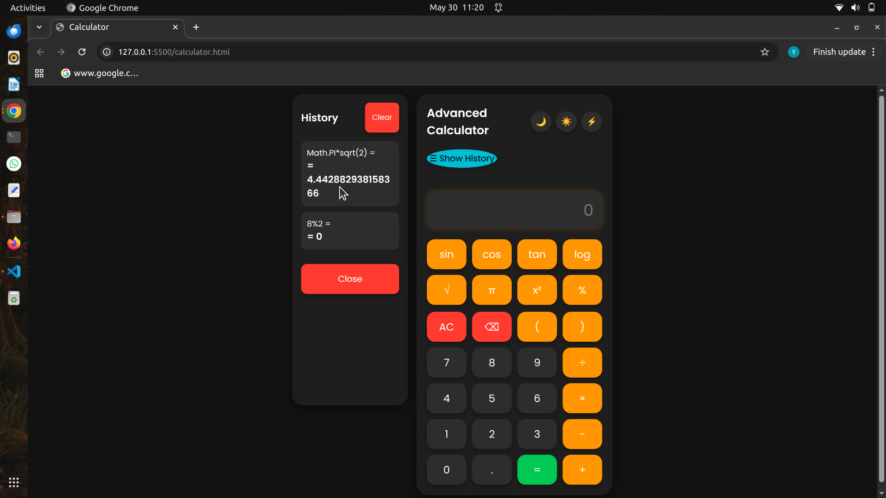
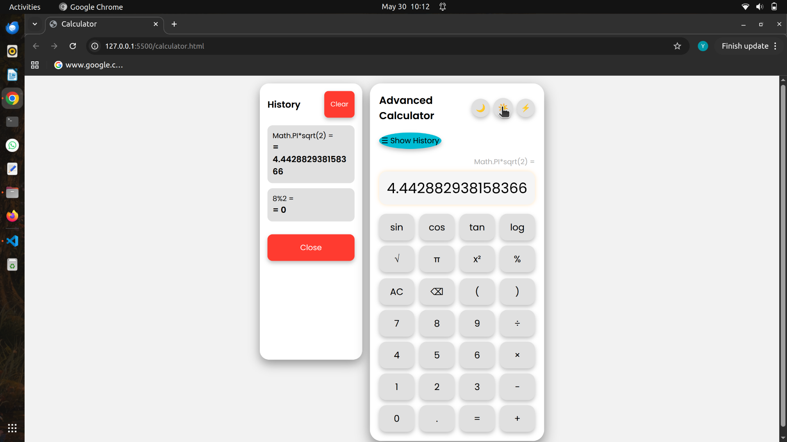
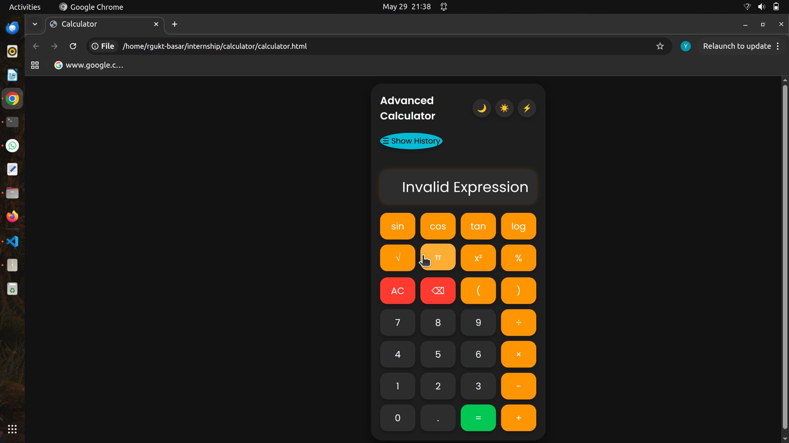
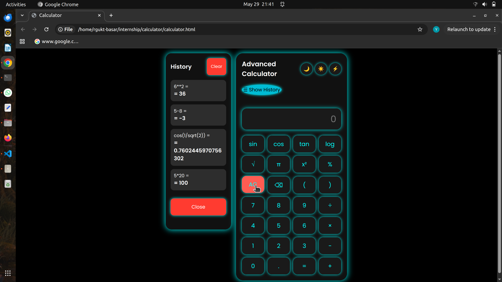

# Advanced Calculator

A modern and responsive Advanced Calculator built using HTML, CSS, and JavaScript. This project was developed as part of an internship to demonstrate frontend development skills, user interface design, and JavaScript programming concepts.

## Features

### Basic Operations

* Addition (+)
* Subtraction (-)
* Multiplication (×)
* Division (÷)
* Percentage (%)
* Decimal calculations
* Parentheses support

### Scientific Functions

* Sine (sin)
* Cosine (cos)
* Tangent (tan)
* Logarithm (log)
* Square Root (√)
* Pi (π)
* Power (x²)

### Additional Features

* Calculation History Panel
* Show/Hide History
* Clear History
* Keyboard Support
* Button Click Sound
* Error Handling
* Responsive Design
* Multiple Themes

### Themes

* Dark Theme
* Light Theme
* Neon Theme

## Technologies Used

* HTML5
* CSS3
* JavaScript (ES6)

## Project Structure

```text
Advanced-Calculator/
│
├── calculator.html
├── style.css
├── script.js
├── README.md
│
├── screenshots/
│   ├── home.png
│   ├── light.png
│   ├── dark.png
│   |── neon.png
|
└── sounds/
    └── click.mp3
```

## Screenshots

### Main Calculator Interface



### Dark Theme



### Light Theme



### Neon Theme




## How to Run

1. Download or clone the project.
2. Open the project folder.
3. Double-click `calculator.html` or open it in your browser.
4. Start using the calculator.

## Error Handling

The calculator detects invalid mathematical expressions and displays:

Invalid Expression

instead of displaying JavaScript errors such as `NaN`.

## Keyboard Shortcuts

| Key       | Action                |
| --------- | --------------------- |
| 0-9       | Enter numbers         |
| + - * /   | Operators             |
| Enter     | Calculate             |
| Backspace | Delete last character |
| Escape    | Clear display         |
| ( )       | Parentheses           |

## Learning Outcomes

This project helped in understanding:

* DOM Manipulation
* Event Handling
* CSS Grid Layout
* Responsive Web Design
* Local Storage
* JavaScript Functions
* UI/UX Design Principles

## Future Enhancements

* Voice Input Calculator
* Unit Converter
* Currency Converter
* Graph Plotting
* Export History to PDF
* Calculator Memory Functions (M+, M-, MR, MC)

## Author

Developed by Yedaboina Bhavya.

As part of Internship Project Work.


# 📬 Connect

* GitHub: https://github.com/bhavyayedaboina
* LinkedIn: https://www.linkedin.com/in/bhavya-yedaboina-212420372/

## License

This project is created for educational and learning purposes.
